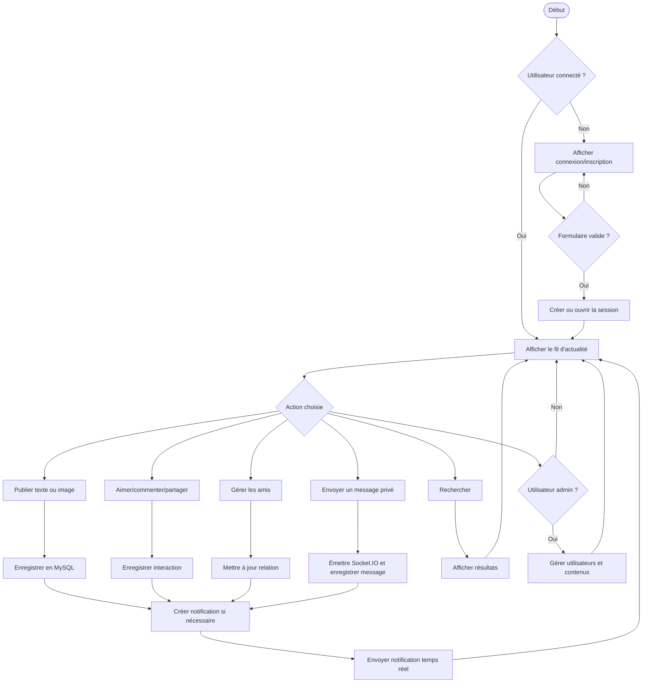

# Diagramme d'activité

```mermaid
flowchart TD
    A([Début]) --> B{Utilisateur connecté ?}
    B -- Non --> C[Afficher connexion/inscription]
    C --> D{Formulaire valide ?}
    D -- Non --> C
    D -- Oui --> E[Créer ou ouvrir la session]
    B -- Oui --> F[Afficher le fil d'actualité]
    E --> F
    F --> G{Action choisie}
    G --> H[Publier texte ou image]
    G --> I[Aimer/commenter/partager]
    G --> J[Gérer les amis]
    G --> K[Envoyer un message privé]
    G --> L[Rechercher]
    G --> M{Utilisateur admin ?}
    H --> N[Enregistrer en MySQL]
    I --> O[Enregistrer interaction]
    J --> P[Mettre à jour relation]
    K --> Q[Émettre Socket.IO et enregistrer message]
    L --> R[Afficher résultats]
    M -- Oui --> S[Gérer utilisateurs et contenus]
    M -- Non --> F
    N --> T[Créer notification si nécessaire]
    O --> T
    P --> T
    Q --> T
    S --> F
    R --> F
    T --> U[Envoyer notification temps réel]
    U --> F
```
